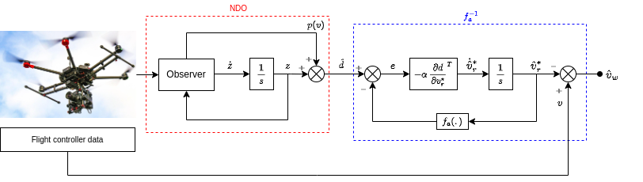

# wind_velocity_observer



This package aims to provide an in-flight estimate of wind velocity for drones.
Given that flight control data and some other parameters are available, the software uses a disturbance observer to estimate external wrenches acting on the body,
and an inversion filter to calculate the vehicle's velocity relative to the air flow. From that, the wind velocity is calculated and the output is given in a ```geometry_msgs::Vector3Stamped``` configurable topic.

## Installation

First, make sure you have [mavros](https://github.com/mavlink/mavros) installed. Clone this repository to your preferred workspace with

```bash
cd ~/my_workspace/src
git clone https://gitlab.com/thalessilva1/wind_velocity_observer.git
source ~/my_workspace/devel/setup.bash
catkin build wind_velocity_observer
```

## Configuration

After cloning the package, refer to ```/config/config.yaml``` file for additional configurations and modify the parameters according to your specifications.
Do not forget to change the scalars ```total_mass```, ```thust_coefficient```, ```rotor_drag_coefficient``` and ```effort_coefficients``` matrix.
Further versions of this package will include techniques to automatically the aerodynamic parameters.

## Usage

Just launch the node with
```bash
source ~/my_workspace/devel/setup.bash
roslaunch wind_velocity_observer wind_velocity_observer.launch
```

Though, since this node needs flight data to generate estimates, you probably should do
```bash
<include file="$(find wind_velocity_observer)/launch/wind_velocity_observer.launch"/>
```
to include this launch file to your general one.

By default, the output topic is ```/estimated_wind_velocity``` and the readings are referenced in ```world``` coordinate frame.

## Contributing
Pull requests are welcome. For major changes, please open an issue first to discuss what you would like to change.
